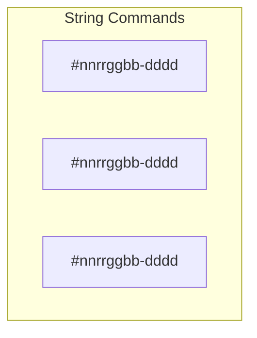
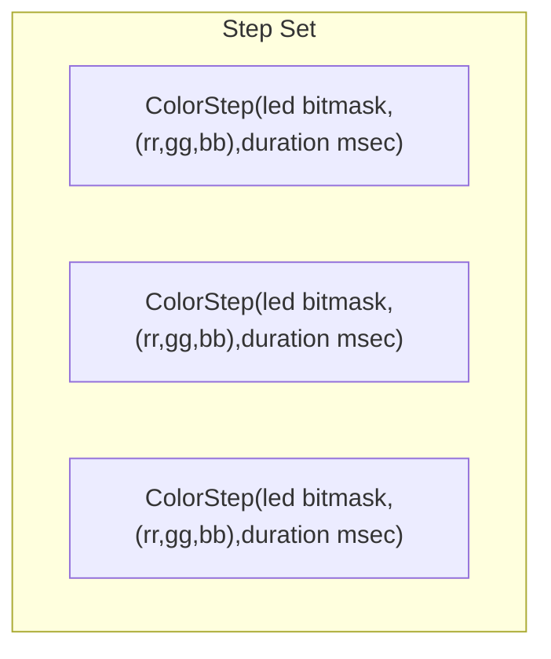

## main.py
This is a **CircuitPython** program that controls device on-board Neopixels over a serial port.  It was written for the [Adafruit Trinkey Neo with 4 Neopixels](https://www.adafruit.com/product/4870) on it. It can be modified for external Neopixel Strings.

The idea was to integrate it with host programs to use this as a busy or meeting status light.

## Prerequisites
Requires the following added to `CIRCUITPY/lib`.
* `adafruit_logging`
    * Available as a single .mpy file in the Adafruit library
* `neopixel`
    * Part of the base CircuitPython base image for boards with onboard Neopixels Ex: _Adafruit Trinkey Neo_

## Setup
_device_ in the following steps refers to to the circuitpython board

1. Plugin the device and verify that the /CIRCUITPY drive is mounted _windows or linux or mac_
1. Copy the `adafruit_logging` library to /lib
1. Copy the `neopixel` library if it isn't part of the base image
1. Copy `main.py` to to the board root, /CICRUITPY
1. Open a command line to the virtual serial port presented by the device.

## TODO
1. Add smooth fade between colors in transition
1. Add support for RGB led (non-neopixels)
1. Add support for supplementary neopixels
    1. Currently supported by passing a different pin into main()
1. Evaluate extending support to more than 8 pixels because of 8 bit pixel mask in command.
1. Look at using a clock rather than hacking the wait tic count in the timer sleep

## Customization
1. Set the logging level to logging.DEBUG in the call to `main()` at the bottom of `main.py`
1. Set the Neopixel pin object and pixel count in the call to `main()` at the bottom of `main.py`
1. Change the default color from blank to something else in the call to `main()` at the bottom of `main.py`

## Tested on
| Board | Functionality | Neopixel location |  USB VID and PID |
| - | - | - | - |
| Trinkey Neo | 4 independently addressable pixels supports | board.NEOPIXEL | VID 239A  PID 80  |

## Commands
| Command | Action |
| - | - |
| ? | show commands |
| # | pixel control with optonal duration - See _Pixel Control Message_ |
| G | Get current pixel |
| B | Blank all pixels |

## Pixel Control Message explained
The board accepts a string over the serial port that is terminated by a newline. That string specifies LED steps which are patterns and pattern duration. The message can can accept an arbitrary number of steps followed by a newline.

`#<led><red><green><blue>-<time in msec>\n`

New commands completely replace the previous patterns. The command is terminated by a new line `\n`

The different parts of a command string are as followed
| paramter | function | notes |
| - | - | - |
| `#` | command initiator and step separator | multiple steps are separated by the `#`
| `<led>` | bit mask of pixels to be touched in this step. Each bit is a pixel | Only allows max 8 neopixels because `led` is two hex digits |
| `<red><green><blue>` | the RGB values 0-255 | in hex |
| `<time in msec>` | value of 0 defaults to 1000 |  period defaults to 1000 msec if no time provided
| `\n` | command terminator | just the new line |

LED Values
* An led value of `ff` means set all LEDs.
* An led value of `00` affects no LEDs and becomes a delay no-op

becomes

### Sample test data
You can copy and paste these strings into a terminal prompt

| Sample | Expected results |
| - | - |
| `#ff000000`                                  | Blank all pixels |
| `#ff010222`                                  | All pixels to the same color |
| `#02A1A2A3-0088`                             | Third pixel changes to this color and holds for 88 msec |
| `#ff010203#ff110000`                         | All pixels switch between these two colors on 1000 msec intervals
| `#ffA1A200-400#ff0040E3-1000`                | All pixels lternate between two color in asymmetrical periods |
| `#ff010200-400#02004023-400#03000000-300`    | 3 step pattern that mixes full and individual pixel updates |
| `#ff010200-400 #00004023-1000 #03000000-300` | 3 step pattern that mixes full and individual pixel updates |
| `#ff000000-100 #01050505-400 #02100000-400 #04081000-400 #0c000010-400` | Clear the colors. Individually update 0 and 1 | set 2 and 3 (bit 4 and 8 ) at same time |

### Bad test data
| Sample | Expected results |
| - | - |
| `#ff01020300-080#ffE1E2E3-0010` | Accepted because _extra_ data in a step is ignored |
| `#000000`                       | Incomplete data. Not accepted |
| `#ffJJJJJJ00`                   | Invalid Numeric. Not accepted |
| `#04A1A2A3-X8888#00E1E2E3-0010` | Non hex characters. Not Accepted |
| `#00000000`                     | Accepted. Essentially a No-Op because no LED is is changed |

## References

This was created to see if the Adafruit Neo Trinkey could be integrated with various busylight software like https://github.com/JnyJny/busylight . That software works with USB attached devices and binds to them with the Vendor ID (VID) an Product ID (PID). It turns out that works fine for the Adafruit boards with real VIDs and PIDS. I was able to add a driver to busylight to support this board in a busylight fork.
