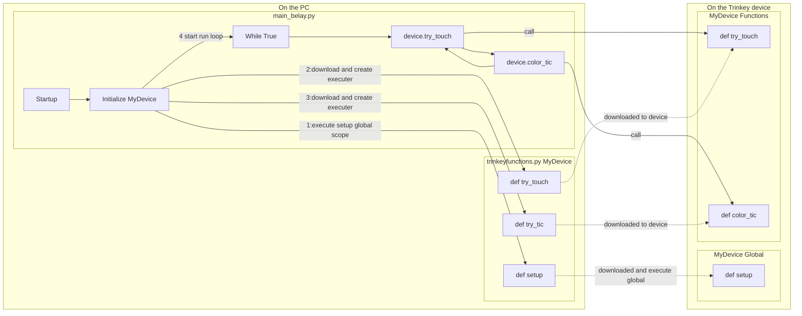

## Capacitive touch run with Belay

# Prequisites
1. Trinkey Neo running CircuitPython

# Running
1. Run `python3 main_belay.py -p <com-port>` to start execution

# Usage
1. This will roll through a pattern in white on the neopixel waiting for your to touch one of the two touch censors.
1. When you touch one of the touch pads, the Neopixels will freeze in a dim color that is associated with the touch pad
1. When you stop touch the touch pads, the program will send a key combination over the HID connection and change the Neopixels to a bright version of the color assicated with at touch pad.
1. The Neopixels will cycle though the normal pattern with the touch censors color one time and then switch back to the white pattern.

# Flow

